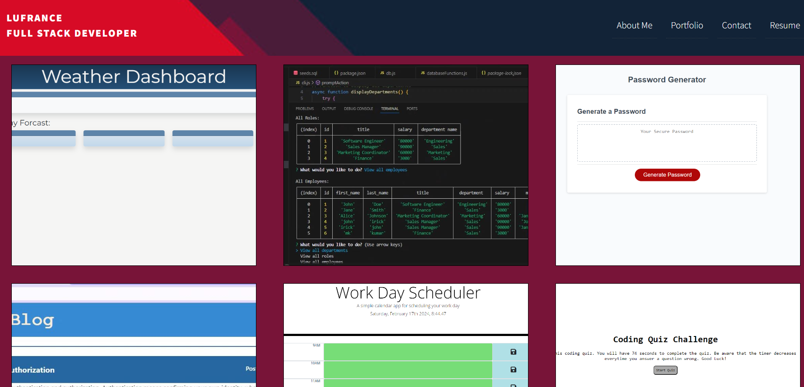
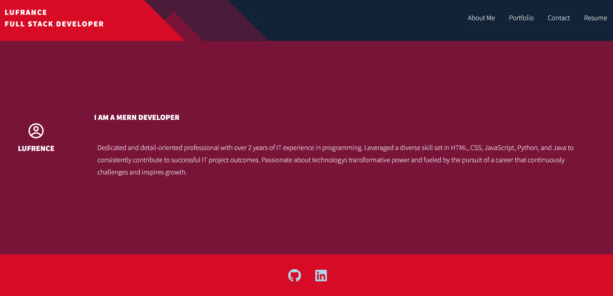

# PERSONAL REACT PORTFOLIO

# Overview
The React Portfolio is a single-page application built to showcase my projects, skills, and contact information. This portfolio allows potential employers or collaborators to view my work samples, learn more about their background, and easily get in touch with me
.

# Features
- Header Component: The portfolio includes a header component that appears on multiple pages, displaying the developer's name and a navigation menu.

- Navigation Component: Within the header, a navigation component allows users to navigate to different sections of the portfolio, including About Me, Portfolio, Contact, and Resume.

- About Me Section: Users can learn more about the developer through a short bio and a recent photo or avatar.

- Portfolio Section: A collection of project tiles is presented in the Portfolio section, each featuring an image of the deployed application, the project title, and links to both the deployed application and the corresponding GitHub repository.

- Contact Form: The Contact section includes a form with fields for name, email address, and message. Users receive notifications if required fields are left blank or if an invalid email address is entered.

- Resume Section: Users can download the developer's resume and view a list of their proficiencies.

- Footer Component: The portfolio includes a footer component that appears on multiple pages, providing links to the developer's GitHub and LinkedIn profiles.

# Installation and Setup

To run the React Portfolio locally, follow these steps:

1. Clone this repository to your local machine using the following command:

<code>git clone https://github.com/lufranckousse/react-personal-portfolio</code>

2. Navigate to the project directory:

<code>cd react-personal-portfolio</code>

3. Install the dependencies:

<code>npm install</code>

4. Start the development server:

<code>npm start</code>

5. Open your browser and visit http://localhost:3000 to view the portfolio.

# Technologies Used
- React.js
- React Router DOM
- HTML5
- CSS3
- JavaScript

# Deployment

The React Portfolio is deployed using Netlify. You can access the live version [here](https://glittery-kelpie-246f17.netlify.app/).

# Screenshots

# Contributing
Contributions are welcome! If you have any suggestions, improvements, or feature requests, please open an issue or submit a pull request.